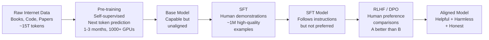

<div align="center">

# PART 1 — THE INTELLIGENCE CORE

### 0% to 25% Knowledge. The foundations that everything else is built on.

[← README](./README.md) | [Part 2 →](./PART2-ArchitecturalEngineering.md)

</div>

> [!NOTE]
> **Who this part is for:** Engineers who want to understand *why* neural networks work, not just how to call an API. If you cannot explain the vanishing gradient problem or why the Transformer replaced the LSTM, this part is for you.

---

## Table of Contents

1. [Probabilistic Reasoning vs Deterministic Logic — The Core Paradigm](#1-probabilistic-reasoning-vs-deterministic-logic)
2. [Machine Learning — The Spectrum of Learning Paradigms](#2-machine-learning)
3. [Neural Networks — The Mathematical Foundation](#3-neural-networks)
4. [The Transformer Architecture — The 2017 Revolution](#4-the-transformer-architecture)
5. [How LLMs Are Trained — The Three-Stage Pipeline](#5-how-llms-are-trained)
6. [Emergent Capabilities — Why Scale Changes Everything](#6-emergent-capabilities)

---

## 1. Probabilistic Reasoning vs Deterministic Logic

This is the most important conceptual distinction in modern AI engineering. Get it wrong and you will design fragile systems.

### Deterministic Systems

```
f(x) = y       — always

Rule: IF temperature > 100°C THEN water_boils = True
Execution: deterministic, reproducible, auditable
Failure mode: anything outside the rule space breaks silently or loudly
```

A thermostat is deterministic. A SQL query is deterministic. A sorting algorithm is deterministic.

### Probabilistic Systems (LLMs)

```
P(y | x, θ)    — probability of output y given input x and parameters θ

"What is the capital of France?" 
→ P("Paris" | input, θ) ≈ 0.9997
→ P("Lyon"  | input, θ) ≈ 0.0002
→ P("Rome"  | input, θ) ≈ 0.0001

The model samples from this distribution at inference time.
Temperature controls the sharpness of this distribution.
```

> [!IMPORTANT]
> **Industry Secret:** LLMs never "know" anything with certainty. They assign probability distributions over all possible next tokens. When an LLM says "Paris," it is not recalling a fact — it is sampling the highest probability token from a learned distribution. This is why hallucination is not a bug to be fixed — it is a *fundamental property* of the architecture. Your job is to constrain the distribution toward truth using RAG, fine-tuning, and guardrails.

### Why This Matters for System Design

```
DETERMINISTIC SYSTEM DESIGN:
  - Test for correctness
  - Catch all edge cases
  - Deploy with confidence
  - Failure is binary (works or crashes)

PROBABILISTIC SYSTEM DESIGN:
  - Test for distribution of outputs (eval sets, not unit tests)
  - Cannot enumerate all edge cases — must sample the distribution
  - Deploy with monitoring and fallback mechanisms
  - Failure is continuous (accuracy degrades, hallucination rate rises)
  - Must measure: P(correct), P(harmful), P(relevant) across thousands of cases
```

**The practical implication:** Your CI/CD pipeline for an AI system must include an **evaluation gate** — a set of benchmark queries where the model must score above a threshold before deployment proceeds. This replaces (or supplements) unit tests.

---

## 2. Machine Learning

### The Learning Paradigm Spectrum

```
SUPERVISION SIGNAL         PARADIGM               EXAMPLES
━━━━━━━━━━━━━━━━━━━━━━━━━━━━━━━━━━━━━━━━━━━━━━━━━━━━━━━━━━━━

Human-labeled pairs     →  Supervised Learning   →  Spam filter, medical diagnosis
  (x, y) pairs

No labels, raw data     →  Unsupervised           →  Customer segmentation, anomaly
                                                      detection, dimensionality reduction

Own labels from data    →  Self-Supervised        →  BERT, GPT, CLIP, DINO
  (mask, predict)           ← ALL MODERN LLMs        This is how we train on internet

Reward from environment →  Reinforcement          →  AlphaGo, robot locomotion, RLHF
  (sparse, delayed)

Human preference pairs  →  RLHF/DPO               →  ChatGPT, Claude, Gemini alignment
  (A > B comparisons)      ← LLM ALIGNMENT
```

### Self-Supervised Learning — Why It Scales

> [!IMPORTANT]
> **The key insight that enabled the LLM era:** Self-supervised learning requires no human labeling. You give the model raw text, mask some tokens, and ask it to predict them. The "label" is the original token — created for free from the data itself. This means you can train on the *entire internet* without a single human annotation. BERT masked 15% of tokens. GPT predicts each next token. Same principle, different masking strategy.

```python
# BERT-style masked language modeling (simplified)
sentence = "The cat [MASK] on the mat"
label    = "sat"  # free label from original text
# Model learns: P("sat" | "The cat ___ on the mat") → maximize this

# GPT-style causal language modeling
prefix = "The cat sat on the"
label  = "mat"  # next token — free label
# Model learns: P("mat" | "The cat sat on the") → maximize this
```

The difference: BERT sees both left and right context (bidirectional). GPT only sees left context (unidirectional). GPT's constraint is what makes it generative — it can continue sequences because it was trained to predict what comes next.

### Reinforcement Learning — The Alignment Bridge

**RLHF (Reinforcement Learning from Human Feedback)** is the critical step that turned GPT-3 (capable but erratic) into ChatGPT (helpful and aligned):

```
Stage 1: Supervised Fine-Tuning (SFT)
  Human writes ideal responses to 1000s of prompts
  Model learns to imitate human-quality responses

Stage 2: Reward Model Training
  Human ranks multiple model responses: Response A > B > C
  Train a neural network to predict human preference scores
  This network IS the reward model

Stage 3: PPO Optimization
  Run the SFT model, generate responses
  Score each response with the reward model
  Use PPO (Proximal Policy Optimization) to adjust model weights
  Maximize expected reward while staying close to SFT distribution (KL constraint)
  
Result: A model that generates responses humans actually prefer
```

**GRPO (Group Relative Policy Optimization)** — DeepSeek R1's method:

```python
# Conceptual GRPO vs RLHF

# RLHF requires a separate reward model (expensive, biased)
reward = reward_model.score(response)
loss = -reward  # maximize reward

# GRPO: generate N responses, grade them, optimize relative to group mean
responses = [model.generate(prompt) for _ in range(N)]
grades = [grade_response(r) for r in responses]  # can be exact match, LLM judge, etc.
baseline = mean(grades)
advantages = [g - baseline for g in grades]
loss = -sum(adv * log_prob for adv, log_prob in zip(advantages, log_probs))
# No reward model needed. More stable. Cheaper. Used in DeepSeek R1.
```

---

## 3. Neural Networks

### The Mathematical Core

A single neuron computes:

$$z = \sum_{i=1}^{n} w_i x_i + b = \mathbf{w}^T \mathbf{x} + b$$

$$\hat{y} = f(z)$$

Where:
- $\mathbf{x} \in \mathbb{R}^n$ — input vector
- $\mathbf{w} \in \mathbb{R}^n$ — weight vector (learned)
- $b \in \mathbb{R}$ — bias (learned)
- $f$ — nonlinear activation function

Without $f$ being nonlinear, a 100-layer network is mathematically equivalent to a single layer. Nonlinearity is what enables universal function approximation.

### Activation Functions — Engineering Choices

| Activation | Formula | Gradient | Use case in 2026 |
|---|---|---|---|
| **ReLU** | $\max(0, x)$ | 0 for x<0, 1 for x>0 | CNNs, residual networks |
| **GELU** | $x \cdot \Phi(x)$ | Smooth everywhere | GPT, BERT, all modern LLMs |
| **SiLU/Swish** | $x \cdot \sigma(x)$ | Similar to GELU | LLaMA, Mistral |
| **Sigmoid** | $\frac{1}{1+e^{-x}}$ | Saturates for large inputs | LSTM gates, output layers |
| **Softmax** | $\frac{e^{x_i}}{\sum_j e^{x_j}}$ | Normalized probabilities | Classification heads, attention |

> [!NOTE]
> **Why GELU over ReLU for LLMs:** ReLU's hard zero for negative inputs creates "dead neurons" that never activate. GELU provides a smooth approximation that allows small gradients even for negative inputs, enabling better training dynamics at the scale of 7B+ parameter models.

### Backpropagation — The Learning Algorithm

The chain rule applied to neural networks:

$$\frac{\partial \mathcal{L}}{\partial w_{ij}^{(l)}} = \frac{\partial \mathcal{L}}{\partial z_j^{(l)}} \cdot \frac{\partial z_j^{(l)}}{\partial w_{ij}^{(l)}} = \delta_j^{(l)} \cdot a_i^{(l-1)}$$

Where $\delta_j^{(l)}$ is the error signal at layer $l$, propagated backward from the loss.

**The vanishing gradient problem** occurs when $|\delta_j^{(l)}| < 1$ at each layer — multiplied across 100 layers, the gradient becomes effectively zero. This is why:
- **ResNets** add skip connections: $\mathbf{h}(x) = F(x) + x$ — gradient can flow directly through the identity path
- **Layer Normalization** keeps activation magnitudes stable
- **ReLU/GELU** have unit gradient for positive inputs, preventing shrinkage

### The Optimization Landscape

```
LOSS SURFACE OF A NEURAL NETWORK

     High loss
     ╔═══════════════════════╗
     ║  ∧∧   ∧∧   ∧∧∧        ║
     ║ /  \ /  \ /   \       ║   ← Local minima (saddle points in high-D)
     ║      ·        ·       ║   ← We rarely get trapped here in high-D
     ║          ·           ·║
     ║              ∨        ║   ← Global minimum (impossible to reach exactly)
     ╚═══════════════════════╝
     Low loss              Parameters →

Key insight: In high-dimensional spaces (7B params), most local minima have 
similar loss to global minimum. Saddle points are the real problem.
SGD + momentum escapes saddle points. Adam adapts to curvature.
```

**AdamW** (the optimizer used in virtually every LLM training run):

$$m_t = \beta_1 m_{t-1} + (1 - \beta_1) g_t$$

$$v_t = \beta_2 v_{t-1} + (1 - \beta_2) g_t^2$$

$$\hat{m}_t = \frac{m_t}{1 - \beta_1^t}, \quad \hat{v}_t = \frac{v_t}{1 - \beta_2^t}$$

$$\theta_{t+1} = \theta_t - \frac{\alpha}{\sqrt{\hat{v}_t} + \epsilon} \hat{m}_t - \alpha \lambda \theta_t$$

The last term $- \alpha \lambda \theta_t$ is **weight decay** — L2 regularization applied directly to weights, not to the gradient update. This is the "W" in AdamW and is critical for LLM training stability.

---

## 4. The Transformer Architecture

### Why the Transformer Replaced Everything

```
RNN/LSTM (pre-2017):              TRANSFORMER (2017+):
━━━━━━━━━━━━━━━━━━━━━━━━━━━━━━━━━━━━━━━━━━━━━━━━━━━━━━━━━━

Sequential processing              Parallel processing
  t=1 → t=2 → t=3 → ...            All tokens processed simultaneously
  
Long-range dependency failure      Long-range dependency via attention
  "The dog that chased [...]        Any token can attend to any other
   was tired" — forgets "dog"       regardless of distance
   
Cannot parallelize on GPU          Fully parallelizable on GPU
  Training is slow                  Training is fast → can scale

Fixed hidden state size            Dynamic context window
  Information bottleneck            All tokens contribute via attention
```

### Full Transformer Architecture

```
INPUT
  "The cat sat on the mat"
       ↓
TOKEN EMBEDDING + POSITIONAL ENCODING
  [token_emb + pos_emb] for each token
  Combines semantic meaning with position information
       ↓
╔══════════════════════════════════════╗
║     TRANSFORMER BLOCK × N layers    ║
║                                      ║
║  ┌─────────────────────────────────┐ ║
║  │    MULTI-HEAD SELF-ATTENTION    │ ║
║  │                                 │ ║
║  │  Q = XW_Q, K = XW_K, V = XW_V  │ ║
║  │  A = softmax(QKᵀ/√d_k) × V     │ ║
║  │  Run h times in parallel        │ ║
║  └─────────────────┬───────────────┘ ║
║                    │                 ║
║  ┌─────────────────▼───────────────┐ ║
║  │    ADD & NORM (Residual)        │ ║
║  │    x = LayerNorm(x + Attention) │ ║
║  └─────────────────┬───────────────┘ ║
║                    │                 ║
║  ┌─────────────────▼───────────────┐ ║
║  │    FEED-FORWARD NETWORK         │ ║
║  │    FFN(x) = GELU(xW₁ + b₁)W₂   │ ║
║  │    Typically 4× wider than d    │ ║
║  └─────────────────┬───────────────┘ ║
║                    │                 ║
║  ┌─────────────────▼───────────────┐ ║
║  │    ADD & NORM (Residual)        │ ║
║  └─────────────────────────────────┘ ║
╚══════════════════════════════════════╝
       ↓ (repeated 12 to 96 times)
OUTPUT HEAD (unembedding)
  Linear layer → logits over vocabulary
  softmax → probability distribution
  sample → next token
```

### Positional Encoding — How the Model Knows Word Order

Without positional encoding, "The dog bit the man" and "The man bit the dog" look identical (same tokens, attention sees all positions equally).

**Sinusoidal Positional Encoding** (original Transformer):

$$PE_{(pos, 2i)} = \sin\left(\frac{pos}{10000^{2i/d_{model}}}\right)$$

$$PE_{(pos, 2i+1)} = \cos\left(\frac{pos}{10000^{2i/d_{model}}}\right)$$

**RoPE (Rotary Position Embedding)** — used in LLaMA, Mistral, Gemini:

Encodes position by rotating the query and key vectors before attention computation. The key advantage: it naturally extends to context lengths beyond those seen during training (with techniques like YaRN or RoPE scaling). This is why LLaMA can extend to 128K+ context even when trained on shorter sequences.

### Flash Attention — Making Long Contexts Feasible

The standard attention computation materializes the full $n \times n$ attention matrix:

$$\text{Memory: } O(n^2), \quad \text{FLOPS: } O(n^2 d)$$

For $n = 100,000$ tokens and $d = 128$: the attention matrix alone is $10^{10}$ entries — 40GB in FP32. Impossible.

**Flash Attention** (Dao et al., 2022) computes the same result without materializing the full matrix by fusing the computation into CUDA kernels and using tiled computation:

$$\text{Memory: } O(n), \quad \text{FLOPS: } O(n^2 d) \text{ (same, but IO-bound reduction)}$$

Result: 2-4x speedup, 5-20x memory reduction. Standard in every modern LLM training and inference stack.

---

## 5. How LLMs Are Trained

### The Three-Stage Pipeline



### Pre-training at Scale — The Numbers That Matter

| Model | Parameters | Training Tokens | Training Cost | Compute (PF-days) |
|---|---|---|---|---|
| GPT-3 | 175B | 300B | ~$4.6M | 3.64 × 10³ |
| LLaMA 3.1 70B | 70B | 15T | ~$30M | ~10⁴ |
| GPT-4 (est.) | ~1.8T (MoE) | ~13T | ~$100M | ~10⁵ |
| DeepSeek V3 | 671B (MoE) | 14.8T | ~$5M | ~10⁴ |
| DeepSeek R1 | 671B (MoE) | — | ~$5M | — |

> [!IMPORTANT]
> **The DeepSeek efficiency shock (Jan 2025):** DeepSeek V3 achieved GPT-4-class performance at ~5% of the training cost. This was not magic — it was disciplined engineering: MoE architecture (only activate 37B/671B params per token), FP8 training, multi-token prediction, and aggressive infrastructure optimization. The lesson: the frontier is not just about scale, it is about engineering efficiency.

### Scaling Laws — The Predictive Science

Hoffmann et al. (2022) — "Chinchilla" scaling laws:

$$L(N, D) = \frac{A}{N^\alpha} + \frac{B}{D^\beta} + L_\infty$$

Where $L$ is loss, $N$ is parameters, $D$ is training tokens.

**The optimal compute allocation:**

$$N_{opt} \propto C^{0.5}, \quad D_{opt} \propto C^{0.5}$$

**Practical implication:** For a fixed compute budget $C$, you should train a model with roughly equal parameter count and token count. A 7B model should be trained on ~140B tokens. This overturned the "bigger model always better" belief and led to the era of compute-optimal models (LLaMA, Mistral, Phi).

---

## 6. Emergent Capabilities

> [!IMPORTANT]
> **One of the most profound phenomena in modern AI:** capabilities that appear suddenly at scale thresholds, with no smooth interpolation from smaller models.

### The Emergence Curve

```
CAPABILITY vs MODEL SCALE

Near-zero                        Sudden emergence
performance                      at scale threshold
    │                                   │
    │  ·  ·  ·  ·  ·  ·  ·  ·  ·  ·  ·  │· ·  ·  ·  ·
    │                                   ·
    │
    └──────────────────────────────────────────→ Scale (params × data)
                            ↑
                        Threshold
                  (different for each task)
```

### Known Emergent Capabilities by Scale

| Capability | Approximate Emergence | Example |
|---|---|---|
| Few-shot learning | ~1B parameters | Learn from 3 examples in-context |
| Chain-of-thought reasoning | ~10B+ parameters | "Let me think step by step" |
| Instruction following | ~7B + fine-tuning | "Summarize this in 3 bullet points" |
| Code generation | ~7B+ | Complete functions from docstrings |
| Multi-step math | ~70B+ | Solve multi-step algebra reliably |
| Analogical reasoning | ~100B+ | "Bird is to nest as human is to ___" |
| Self-correction | ~70B+ (with prompting) | "Wait, let me reconsider..." |
| Planning with tools | ~7B + RLHF + tools | "I should search before answering" |

**Why emergence happens:** Current hypothesis is that tasks requiring multiple compositional steps all become simultaneously solvable when the model is large enough to represent each step well. The model "crosses a threshold" where it can chain sub-capabilities together.

---

## Part 1 Summary

```
WHAT YOU NOW UNDERSTAND:
━━━━━━━━━━━━━━━━━━━━━━━

Paradigm    → AI reasons probabilistically over distributions, not deterministically
Learning    → Self-supervised learning on raw data is what made scale possible
Math        → Attention is QKV dot products with softmax normalization
Architecture → Transformers parallelize, ResNets propagate gradients, LayerNorm stabilizes
Training    → 3 stages: pre-train (scale) → SFT (alignment) → RLHF/DPO (preference)
Scale       → Chinchilla laws: balance parameters and tokens for optimal compute
Emergence   → Capabilities appear discontinuously at scale thresholds

WHAT THIS MEANS FOR YOUR SYSTEM DESIGN:
━━━━━━━━━━━━━━━━━━━━━━━━━━━━━━━━━━━━━━

→ Never trust LLM output without validation (probabilistic = sometimes wrong)
→ Bigger context window ≠ better reasoning (attention quality degrades at ends)
→ The model you pick determines your capability ceiling
→ RLHF models are not aligned by magic — they are aligned to match human preferences
   on the specific preference data used. Distribution shift = alignment failure.
→ Emergent capabilities mean: test at your production scale, not at prototype scale
```

---

<div align="center">

**The foundation is set. Now let's build on it.**

## [→ Part 2: Architectural Engineering](./PART2-ArchitecturalEngineering.md)

*RAG systems that actually work. Fine-tuning that actually improves. The architecture decisions that separate production from prototype.*

[← README](./README.md) | [Part 2 →](./PART2-ArchitecturalEngineering.md)

</div>
