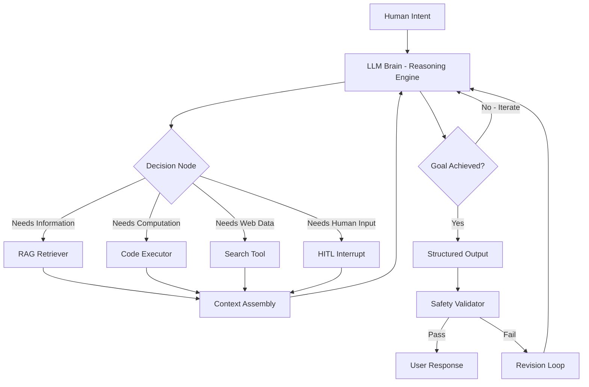

<div align="center">


# 🧠 World of AI — Professional Intelligence Framework 2026

### The definitive open-source knowledge architecture for engineers building systems that THINK, not just TALK.

> *"We are not building chatbots. We are engineering cognitive infrastructure."*

[](https://opensource.org/licenses/MIT)
[]()
[]()
[]()
[]()

</div>

---

> [!IMPORTANT]
> **This is not a tutorial collection. This is a Professional Intelligence Framework.**
> Every section is written for engineers who want to understand *why* before *how* — and who are building systems for production, not demos. If you want beginner Python tutorials, this is the wrong repository. If you want to understand how intelligence is engineered at scale — read every word.

---

## The Architecture of Intelligence

Before we write a single line of code, understand what we are actually building.

The AI systems of 2026 are not "smart search engines." They are **probabilistic reasoning engines** layered on top of statistical pattern matchers, wrapped in orchestration frameworks, constrained by alignment techniques, and deployed with production engineering discipline.

```
DETERMINISTIC LOGIC          vs          PROBABILISTIC REASONING
━━━━━━━━━━━━━━━━━━━━━━━━━━━━━━━━━━━━━━━━━━━━━━━━━━━━━━━━━━━━━━

if temperature > 100:                    P("water boils" | temp=105°C) ≈ 0.999
    return "water boils"                 P("pasta done" | timer=8min, context) ≈ 0.87
                                         P("user wants X" | message, history) ≈ 0.76

Rule must be hardcoded                   Model infers rules from data distribution
Fails on edge cases not in rules         Generalizes to unseen inputs
Explainable by inspection                Requires interpretability tools (SHAP, LIME)
Zero hallucination risk                  Hallucination is a fundamental property
Cannot improve without reprogramming     Improves with more data and RLHF
```

**The fundamental insight:** An LLM is a compressed representation of human knowledge, accessible through natural language, with inference governed by probability distributions over tokens. Every "decision" it makes is sampling from a learned distribution. Your job as an AI engineer is to shape that distribution toward utility, accuracy, and safety.

---

## The 2026 Professional Intelligence Stack

> [!NOTE]
> This table represents the production-grade technology choices used by teams shipping agentic systems at scale in 2026. Not theory — deployed reality.

| Layer | Category | Production Choice | Open Source Alt | Notes |
|---|---|---|---|---|
| **Foundation Models** | Reasoning | Claude 3.7 / o3 | DeepSeek R1 | Reasoning models for complex tasks |
| **Foundation Models** | Fast/Cheap | Gemini 2.0 Flash | Qwen 2.5 7B | High-frequency calls |
| **Foundation Models** | Code | Claude 3.5 Sonnet | DeepSeek Coder V2 | SWE-bench SOTA |
| **Foundation Models** | On-Device | Gemini Nano / Phi-4 | LLaMA 3.2 1B | Privacy-sensitive |
| **Orchestration** | Agent Framework | LangGraph | AutoGen 0.4 | Stateful agent graphs |
| **Orchestration** | Multi-Agent | CrewAI 2.0 | AutoGen Swarms | Role-based teams |
| **Orchestration** | Workflow | Temporal + LangGraph | Prefect | Durable agent execution |
| **Vector Storage** | Cloud Managed | Pinecone Serverless | Qdrant Cloud | Hybrid search built-in |
| **Vector Storage** | Self-Hosted | Weaviate | Milvus 2.4 | Full control |
| **Vector Storage** | Lightweight | ChromaDB | FAISS | Dev/Prototype |
| **Embeddings** | Quality | text-embedding-3-large | BGE-M3 | Best retrieval accuracy |
| **Embeddings** | Efficient | text-embedding-3-small | all-MiniLM-L6-v2 | Cost/quality balanced |
| **Evaluation** | RAG | RAGAS 0.2 | TruLens | Faithfulness, relevancy |
| **Evaluation** | Agent | LangSmith | Phoenix (Arize) | Trace-level debugging |
| **Evaluation** | Safety | Llama Guard 3 | NeMo Guardrails | Input/output validation |
| **Serving** | LLM Inference | vLLM 0.5+ | TGI | PagedAttention, 10x throughput |
| **Serving** | API Gateway | FastAPI + LiteLLM | Kong AI Gateway | Multi-provider routing |
| **Observability** | Tracing | LangSmith + Langfuse | OpenTelemetry | Full agent traces |
| **Storage** | Session Memory | Redis 7+ | DragonflyDB | Sub-ms latency |
| **Storage** | Long-term Memory | Mem0 + Pinecone | Zep | User-level memory |
| **Infrastructure** | Containers | Docker + K8s | Docker Compose | Scale to zero |
| **Infrastructure** | CI/CD | GitHub Actions | ArgoCD | Eval-gated deployment |
| **Infrastructure** | Cloud | AWS Bedrock / GCP Vertex | Replicate | Serverless LLM |

---

## Repository Structure — The 4-Part Intelligence Architecture

```
world-of-ai/
├── README.md                    ← You are here. The Master Framework.
│
├── PART1-Foundations.md         ← THE INTELLIGENCE CORE (0-25%)
│   ├── Probabilistic Reasoning vs Deterministic Logic
│   ├── The Mathematics of Attention (with LaTeX)
│   ├── How Neural Networks Actually Learn
│   ├── The Transformer Architecture — Deep Dive
│   └── Self-Supervised Learning at Scale
│
├── PART2-ArchitecturalEngineering.md  ← ARCHITECTURAL ENGINEERING (26-50%)
│   ├── Advanced RAG — GraphRAG, Hybrid Search, Re-ranking
│   ├── Fine-Tuning with LoRA/QLoRA — Domain Adaptation
│   ├── Reasoning Models — Test-Time Compute Scaling
│   ├── Multimodal Architecture — Beyond Text
│   └── The Model Compression Playbook
│
├── PART3-AgenticSuperstructure.md  ← THE AGENTIC SUPERSTRUCTURE (51-75%)
│   ├── Autonomous Agent Loops — Plan → Act → Observe
│   ├── Tool-Calling Schema and JSON Contracts
│   ├── Multi-Agent Swarms — CrewAI / AutoGen 2026
│   ├── LangGraph — Stateful Cognitive Graphs
│   └── Memory Architecture — Short, Long, Episodic
│
└── PART4-ProductionSafety.md    ← PRODUCTION & SAFETY (76-100%)
    ├── Deployment — Quantization, VPC Security, Rate Limiting
    ├── Guardrails — NeMo, Llama Guard 3, Custom Validators
    ├── Sustainability — Token Economics and Latency Engineering
    ├── AGI Trajectory — What Comes After LLMs
    └── The Alignment Problem — Why Safety is Engineering
```

---

## The AGI Trajectory — Context for Everything You Build

> [!IMPORTANT]
> **Industry secret that most tutorials skip:** Every system you build today is on the path to AGI. Understanding where we are on that path determines what architecture decisions make sense.

### The Capability Ladder

```
NARROW AI (1950s–2010s)
  Chess engines, spam filters, image classifiers
  One task, one domain, cannot generalize
  Current status: Solved. Commodity.

GENERAL AI — Language (2017–2023)
  GPT-3/4, Claude, Gemini — can discuss anything
  Pattern matching over compressed human knowledge
  Limitation: reactive, no persistent agency

AGENTIC AI (2024–2026) ← WE ARE HERE
  Systems that plan, act, and iterate autonomously
  Multi-step reasoning, tool use, self-correction
  Limitation: still bounded by training distribution

REASONING AI (2025–?) ← EMERGING NOW
  o3, DeepSeek R1, Claude 3.7 — think before acting
  Test-time compute scaling breaks the training-bound ceiling
  Limitation: expensive, slow, not yet reliable enough for all tasks

ARTIFICIAL GENERAL INTELLIGENCE (2027–2030?)
  Systems that can learn any intellectual task humans can
  Not a single model — likely an orchestrated system of agents
  The question is not if — it's when, and whether we're ready

ARTIFICIAL SUPERINTELLIGENCE
  Beyond human cognitive ability in all domains
  Requires alignment to be solved first
  The reason Anthropic, OpenAI, and DeepMind exist as safety-focused labs
```

### Where Agentic AI Fits



This is not a chatbot. This is a cognitive loop. Your architecture must support every node in this graph.

---

## The Attention Mechanism — The Mathematics That Makes It Work

> [!NOTE]
> This is the single most important formula in modern AI. If you understand this deeply, you understand why LLMs work.

The Transformer's core operation — **Scaled Dot-Product Attention** — computes:

$$\text{Attention}(Q, K, V) = \text{softmax}\left(\frac{QK^T}{\sqrt{d_k}}\right)V$$

Where:
- $Q \in \mathbb{R}^{n \times d_k}$ — Query matrix (what am I looking for?)
- $K \in \mathbb{R}^{m \times d_k}$ — Key matrix (what do I have to offer?)
- $V \in \mathbb{R}^{m \times d_v}$ — Value matrix (what information do I carry?)
- $d_k$ — Dimension of key vectors (scaling factor to prevent gradient vanishing)
- $n$ — Sequence length of queries
- $m$ — Sequence length of keys/values

**Multi-Head Attention** runs this $h$ times in parallel with learned projections:

$$\text{MultiHead}(Q, K, V) = \text{Concat}(\text{head}_1, \ldots, \text{head}_h)W^O$$

$$\text{head}_i = \text{Attention}(QW_i^Q, KW_i^K, VW_i^V)$$

**Why the $\sqrt{d_k}$ scaling matters:** Without it, for large $d_k$, dot products grow large in magnitude → softmax saturates → gradients vanish → training destabilizes. The scaling keeps values in a regime where softmax has useful gradients.

**The engineering implication:** Flash Attention (Dao et al., 2022) rewrites this computation to never materialize the full $n \times m$ attention matrix in HBM — reducing memory from $O(n^2)$ to $O(n)$ and enabling 1M+ token contexts.

---

## Navigating This Repository

### By Your Role

| Role | Start Here | Then Read |
|---|---|---|
| **ML Engineer new to LLMs** | Part 1 fully | Part 2 → Part 4 |
| **Backend Engineer building AI features** | Part 1 Sections 3-5 | Part 3 → Part 4 |
| **Data Scientist moving to AI Engineering** | Part 2 fully | Part 3 → Part 4 |
| **Senior Engineer architecting AI systems** | This README | Part 3 → Part 4 |
| **AI Researcher** | Part 1 mathematics | Part 2 → Part 3 theory |
| **Product Engineer** | This README | Part 3 → Part 4 deployment |

### By Goal

| Goal | Path |
|---|---|
| **Understand how LLMs actually work** | README → Part 1 → Part 2 |
| **Build a production RAG system** | Part 2 Advanced RAG → Part 4 Deployment |
| **Build a multi-agent workflow** | Part 3 fully → Part 4 Safety |
| **Deploy AI to production** | Part 4 fully |
| **Understand AGI trajectory** | README AGI section → Part 4 alignment |
| **Optimize costs at scale** | Part 4 Token Economics |

### By Time Available

```
10 minutes  → Read this README completely
1 hour      → README + Part 1 (Foundations)
4 hours     → Parts 1 + 2 (Foundation + Architecture)  
1 day       → Parts 1 + 2 + 3 (Full theory to agents)
1 weekend   → All 4 parts + implement one project
1 month     → All parts + build 3 production projects
```

---

## The Agent-First Principle

> [!IMPORTANT]
> **The paradigm shift of 2025-2026:** Stop thinking about AI as a question-answering service. Start thinking about AI as a **cognitive employee** that can be given a goal, a set of tools, and a set of constraints — and will figure out how to achieve the goal.

Every concept in this repository is taught through the lens of **systems that act**, not systems that respond.

```
OLD MENTAL MODEL (2022-2023):
  User asks question → LLM generates answer → done
  AI is a smart autocomplete

NEW MENTAL MODEL (2024-2026):
  Human defines goal → Agent plans → Agent executes with tools
  → Agent observes result → Agent corrects → Agent delivers
  AI is a cognitive collaborator
```

This distinction shapes every architecture decision you will make.

---

## The Signal/Noise Contract

This repository operates under a strict contract:

- **0% fluff.** No "AI is amazing!" motivational content.
- **100% signal.** Every sentence earns its place with technical depth.
- **Analogy-first.** Every abstract concept gets a concrete analogy before the math.
- **Code-grounded.** Every architectural claim has a working code example.
- **Production-bias.** Everything is written for systems that need to work at 3am without human intervention.

---

## Contributing

This repository is a living knowledge base. If you know something that belongs here:

1. Fork the repository
2. Branch: `git checkout -b add/section-name`
3. Write with the Signal/Noise Contract in mind
4. Submit a PR with: what you added, why it matters, and a source

**What we actively want:**
- Production incident post-mortems from real AI systems
- Benchmark comparisons with reproducible methodology
- Novel architectural patterns with measured results
- Safety/alignment research made accessible

**What we do not want:**
- Marketing content or vendor comparisons without evidence
- Tutorial-style "here is how to use the API" without depth
- Content that duplicates existing sections without improvement

---

## The Reading Order — Recommended

```
README (here)
    ↓
PART 1: Intelligence Core
    — Probabilistic reasoning and why it matters
    — The mathematics of Transformers
    — How LLMs are trained and why that shapes their behavior
    ↓
PART 2: Architectural Engineering
    — Advanced RAG: the techniques that separate demos from production
    — Fine-tuning: when to do it, how to do it right
    ↓
PART 3: The Agentic Superstructure
    — The cognitive loop architecture
    — Multi-agent orchestration
    — Memory systems
    ↓
PART 4: Production and Safety
    — Making agents reliable, secure, and cost-controlled
    — The alignment problem as an engineering problem
    — Where AGI fits in your 5-year career plan
```

---

<div align="center">

**Built and maintained by [Amruth Kumar M](https://github.com/Amruth011)**

*AI and Data Science Engineer | REVA University | Bengaluru, India*

*Founder, Assured Tech Future*

---

**[⭐ Star this repository](https://github.com/Amruth011/world-of-ai)** if it gives you value.
**[🔱 Fork it](https://github.com/Amruth011/world-of-ai/fork)** if you want to build on it.
**[📬 Open an issue](https://github.com/Amruth011/world-of-ai/issues)** if something is wrong or missing.

*Last updated: March 2026. Updated quarterly as the field evolves.*

</div>
